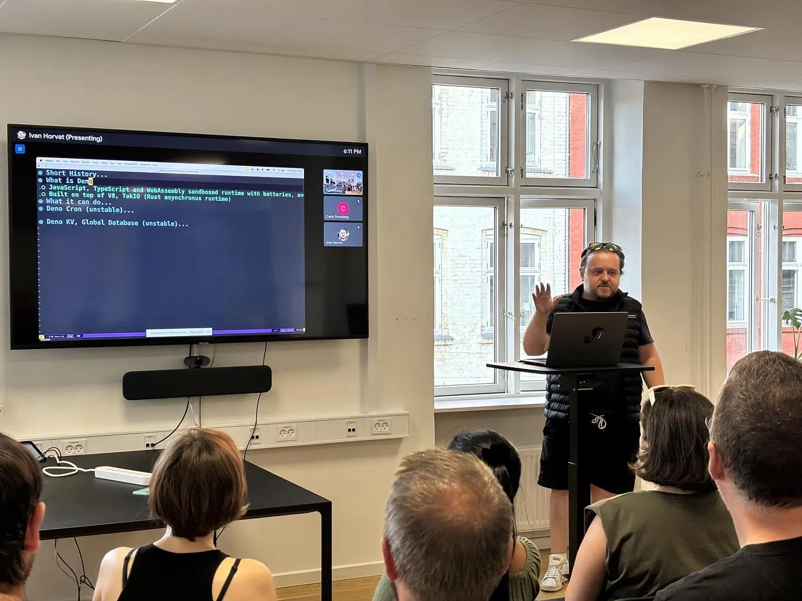

# Copenhagen JS

## Deno not just runtime

### Ivan Zvonimir Horvat

### 5th September 2024

### Preview of [upcoming Deno 2.0](https://deno.com/blog/v1.46) features



## Slides

[Slides](slides/deno.org) are done in
[ORG mode](https://develop.spacemacs.org/layers/+emacs/org/README.html) and best viewed with emacs [tree slide](https://github.com/takaxp/org-tree-slide)
extension

## Run Examples

### Prerequisites

- [Rust](https://www.rust-lang.org/learn/get-started)
- [Deno](https://docs.deno.com/runtime/fundamentals/installation/)

```shell
# Install Rust
curl --proto '=https' --tlsv1.2 -sSf https://sh.rustup.rs | sh

# Add web assembly target
rustup target add wasm32-unknown-unknown

# Install Deno (will be single executable file)
curl -fsSL https://deno.land/install.sh | sh
```

### Generate [WASM](https://github.com/denoland/wasmbuild) portable binary

```shell
deno task wasmbuild
```

### Example 1: CLI command
- [Deno KV: Queue](https://docs.deno.com/deploy/kv/manual/queue_overview/)
- [Deno KV: Database](https://deno.com/kv)
- [Deno Cron](https://deno.com/blog/cron)


```shell
# Please run each command in separate shell
# First run Deno KV queue
deno task queue

# Second run Deno Cron
# - one cron job to show counter of succeeded and failed conversions
# - second cron job to delete converted files older than 3 minutes
deno task cron

# Run converter
deno task graying -h # Help command
deno task graying -f sample.webp
```

### Example 2: Deno Fresh Example
- [Deno Fresh](https://fresh.deno.dev/)
- [Photon Rust library](https://github.com/silvia-odwyer/photon)

```shell
# Serve wasm file on port 3000
deno task file-server

# Serve Fresh app on port 8000
deno task start
```

### Notable commands

```shell
# Format
deno fmt

# Linter
deno lint

# Tests
deno test

# Benchmarks
deno bench

# Generate docs
deno doc

# Run task
deno task

# Information about module and cached directories
deno info
```
